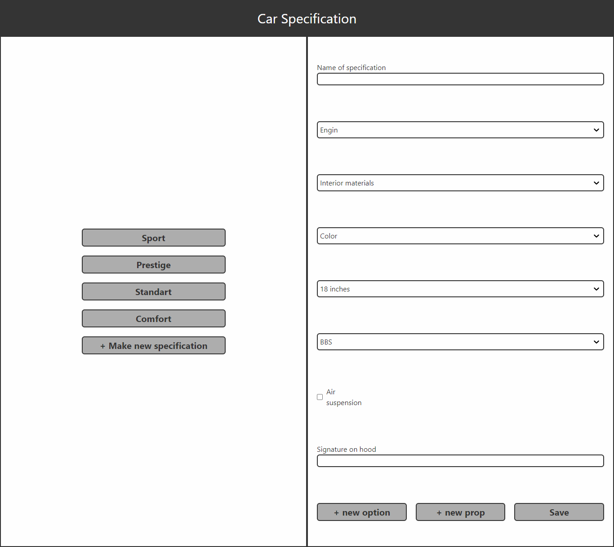

# Introduction

This project is display cars specification and can add some specification.
This project make with React, Typescript and TailwindCSS.
 
In this project, use useContext hook was used to manage data.

## Screenshot

